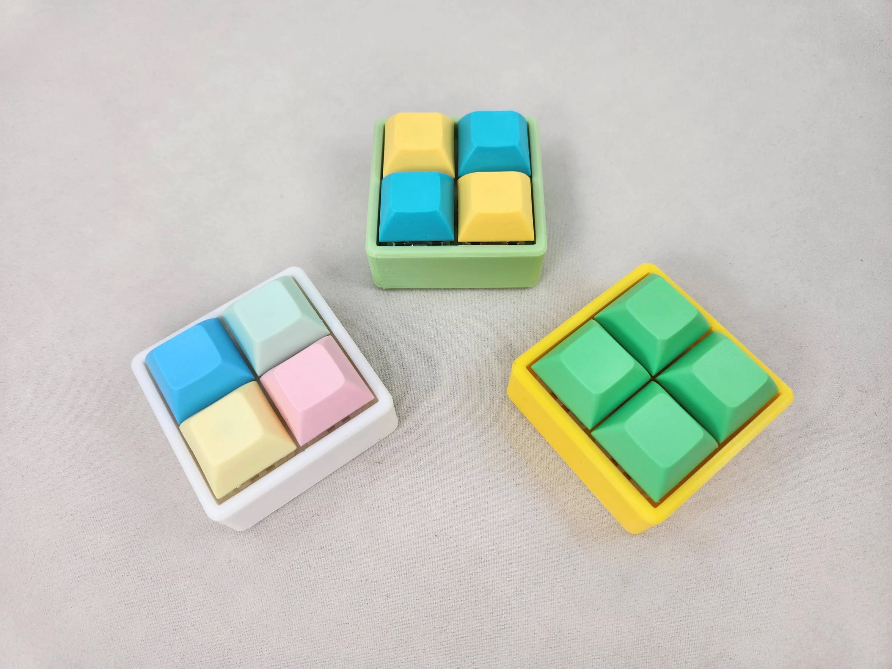
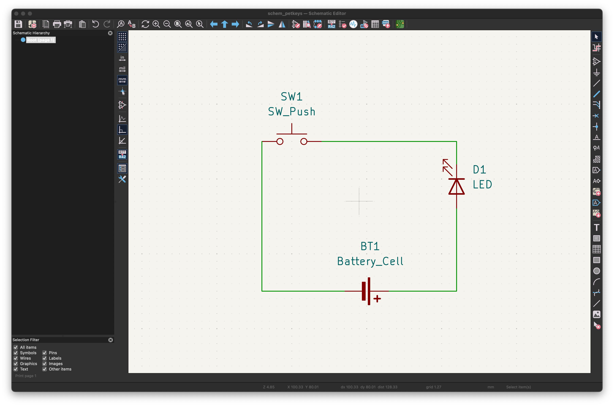
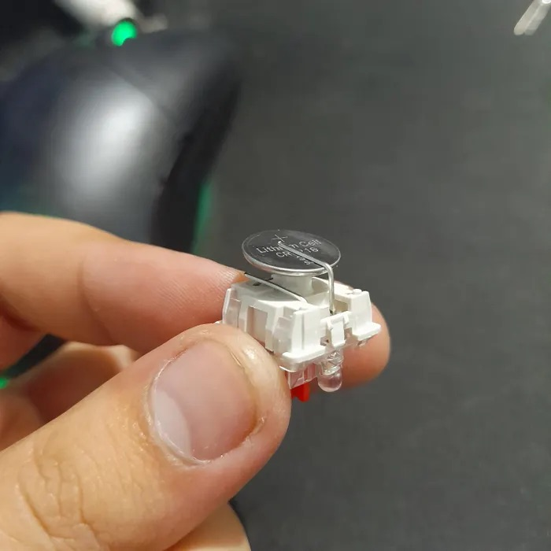
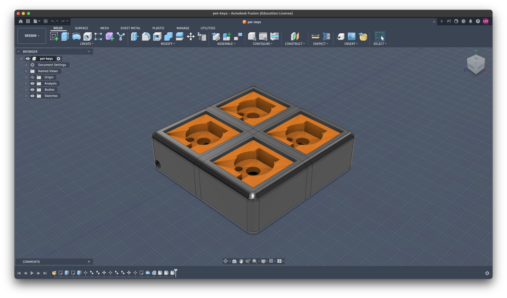
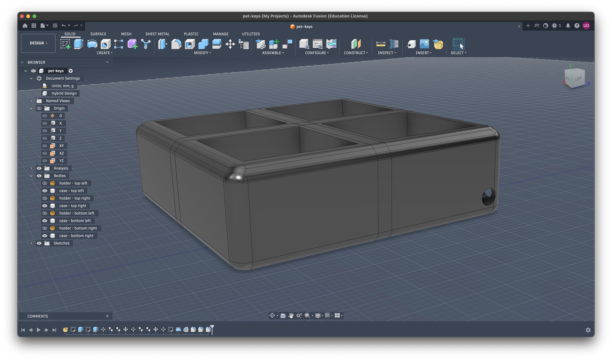

# pet-keys
pet your fidget keys like you pet your cat

## Inspiration from:

## Schematics
> added a pdf file from kicad export in the 'schem' folder

how it should look like in real

## Case - 3D Printed

case assembled with all part needed for it

case image without holder

## BOM
| S. | Component                      | Quantity | Price (INR)                          | Price (USD) | Link                                                                                         |
|----|--------------------------------|----------|--------------------------------------|-------------|----------------------------------------------------------------------------------------------|
| 1. | 3D Printed Case + Holder       | 5        | (shipping only)  | -           |    (from printing legion)                                                                                          |
| 2. | Mechanical Switch (pack of 10) | 2        | 700.00 + 82.00 (shipping) = 782.00                          | 8.28        | https://stackskb.com/store/menel-eight-nine-haku-linear-switch-pack-of-10/                   |
| 3. | Keycaps (pack of 10)           | 2        | 1272.00                              | 13.47       | https://www.amazon.in/gp/product/B0F14119N8/ref=ox_sc_act_title_4?smid=AH0KEO6T9U8SH&psc=1   |
| 4. | CR1220 Battery (pack of 5)     | 4        | 1052.00                              | 11.14       | https://www.amazon.in/gp/product/B0BRCVFC5D/ref=ox_sc_act_title_1?smid=AJ6SIZC8YQDZX&psc=1   |
| 5. | Blue 3mm LEDs (pack of 20)      | 1        | 29.00 + 69.00 (shipping) = 98.00     | 1.04        | https://electronicspices.com/product/3mm-basic-blue-led-round-shape-pack-of-20-blue-in-clear |

**Total Cost**: 3204.00 INR = 33.92 USD (excluding shipping needed by printing legion)

> Note #1: need something around $35 to cover any conversion tax + shipping by printing legion

> Note #2: tried my best to find alternative to the LED to save on shipping, but no other vendor has 3mm ones, and amazon listing has the ones from the same vendor with higher shipping

> Note #3: need 5 of the cases to not waste any switches / keycaps / leds / battery. all of the items from the BOM will be used completely

> Note #4: conversion rate might change. one in BOM is as per google on 18 Jun 10:30am IST

> Note #5: cart screenshots added in cart_screenshots folder

## Credits
- made by me
- 3D case made in Fusion
- Schem in KiCad
- sample assembly + circuit from: [https://www.instructables.com/Keyboard-Switch-Keychain/]